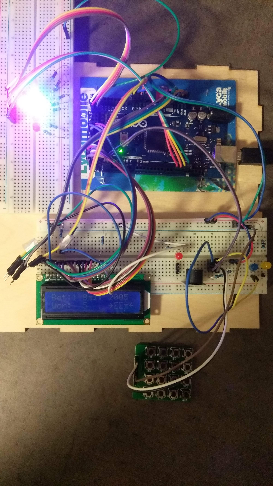
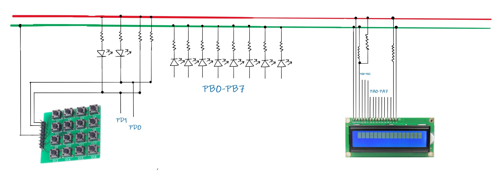

# Slotmachine 

This code has be instantly compiled and tested on the avr platforms on atmel studios. The ports can be easily changes by editing macros in [Config.h](SlotMachineAtmelProject/SlotMachineAtmelProject/Config.h). Detailed description of design, UML & flowchart diagrams, testing report, etc is present in this [document](latex/report.pdf).

The project has **lcd library** which can be used independently in any other projects using files [LcdLibrary.h](SlotMachineAtmelProject/SlotMachineAtmelProject/LcdLibrary.h) and [LcdLibrary.c](SlotMachineAtmelProject/SlotMachineAtmelProject/LcdLibrary.c). These ports and pins of LCD can be easily changed by changing the MACROS in header file.
***

The project mimics the casino slot machine with a lcd and two buttons. 

***

The circuit diagram for the connection is below.

